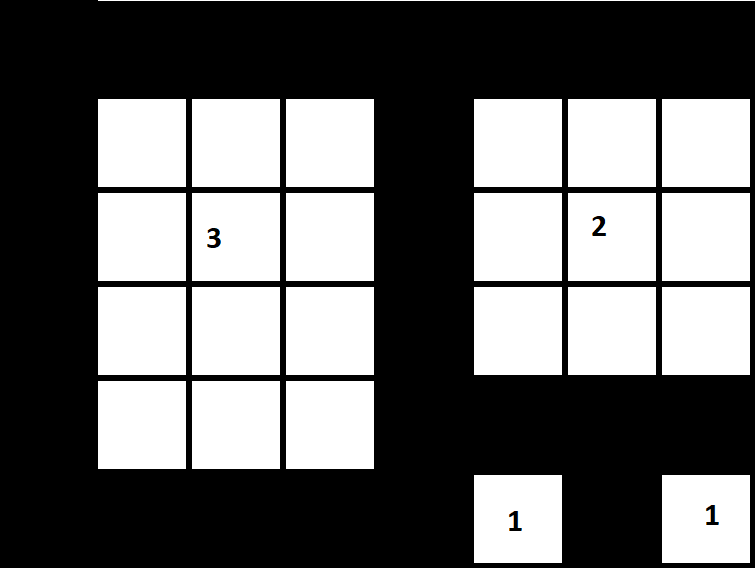

# Fibonacci squares

## How to run

Open **index.html** file from one of folders (where "js_characters" prints number of iteration and "js_colors" prints colorful squares as a pixels).

If you want to change number of iterations you must edit **index.js** file and change value of **ITERATIONS** variable at the to of the file.

## Description

This project prints Fibonacci squares in the web browser console. Squares have dimensions: 1, 1, 2, 3, 5, 8, 13, etc. "pixels".
Default number of iterations: **10**.

I decided to do it as square characters or iteration number, because when I was trying to print grid of filled and empty points I run into a problem with width/height of next square. (Shown on image below)
When I want to print first iteration with border and second with border, I used 3 pixel. In next step I should print 3 pixels square but I want to have 2 pixels. Problem is increasing in next steps.

Finnaly I'm puting characters for each pixel of square. Result of run of colorful version (from "js_colors" folder) is shown on screenshot below:

Code was tested with Edge Web Browser (Chromium engine). But in case of any problem with rendering colors in console, I prepared also second version which printing number of iteration instead of color. The result of this version is shown below:

